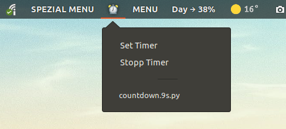
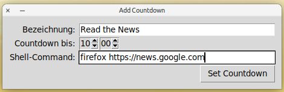

# countdown

Countdown is a kind of alarm clock that reminds you of the next task. It plays a sound and runs an optional program at the time you specify. You will be reminded to get the next task done and stay focused without overwhelming you with all of the day's tasks. Countdown works in conjunction with **Argos** - GNOME Shell Extension to get the launcher menu into the GNOME shell.

## Usage
You set the timer with the reminder text and the time you want to be reminded. The range of time ahead is less the 24:00.

## Requirements
- Python 3 installed on your PC

## Installation
Copy all the files to your `~/.config/argos/` directory. Make all Python files (*.py) exectuable: `chmod -R 775 ~/.config/argos/*.py`.

## Relies on
You need to install argos (https://github.com/p-e-w/argos) to use this script in the GNOME Shell. Argos allows you to write code that runs regularly or can be used as a menu.

## License
Licensed under the [MIT License](https://opensource.org/licenses/MIT).

